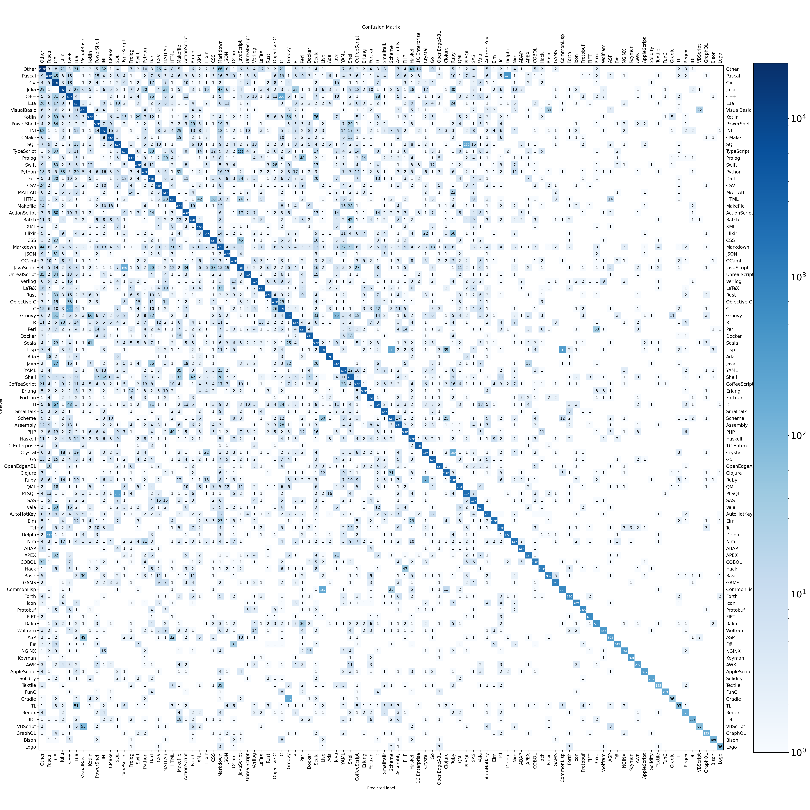

# Telegram Programming Language Detection ML Contest

This repo contains my solution of [TG ML contest](https://contest.com/docs/ML-Competition-2023).

## Task
The task was to define the programming language only by the code snippet. The inference should be fast: the text of **4096 bytes** should be processed in less than **10 ms**.

This solution supports all the languages that were proposed by organizers. Here "Other" is not a language / not any of presented below:

| Language      | Precision | Language      | Precision | Language      | Precision | Language      | Precision | Language      | Precision |
| ------------- | ------------ | ------------- | ------------ | ------------- | ------------ | ------------- | ------------ | ------------- | ------------ |
| Other         | 98%        | 1C Enterprise | 99%        | ABAP          | 98%        | ActionScript  | 93%        | Ada           | 99%        |
| Groovy        | 89%        | APEX          | 92%        | AppleScript   | 85%        | ASP           | 69%        | Assembly      | 95%        |
| AutoHotKey    | 94%        | AWK           | 81%        | Basic         | 88%        | Batch         | 95%        | Bison         | 78%        |
| C             | 88%        | Clojure       | 96%        | CMake         | 98%        | COBOL         | 92%        | CoffeeScript  | 92%        |
| CommonLisp    | 74%        | C++           | 94%        | Crystal       | 89%        | C#            | 98%        | CSS           | 97%        |
| CSV           | 97%        | D             | 90%        | Dart          | 95%        | Delphi        | 81%        | Docker        | 98%        |
| Elixir        | 96%        | Elm           | 94%        | Erlang        | 97%        | FIFT          | 97%        | Forth         | 92%        |
| Fortran       | 98%        | F#            | 82%        | FunC          | 88%        | GAMS          | 93%        | Go            | 95%        |
| Gradle        | 15%        | GraphQL       | 80%        | Hack          | 90%        | Haskell       | 95%        | HTML          | 95%        |
| Icon          | 93%        | IDL           | 64%        | INI           | 94%        | Java          | 93%        | JavaScript    | 87%        |
| JSON          | 98%        | Julia         | 95%        | Keyman        | 97%        | Kotlin        | 94%        | LaTeX         | 96%        |
| Lisp          | 83%        | Logo          | 83%        | Lua           | 96%        | Makefile      | 96%        | Markdown      | 90%        |
| MATLAB        | 98%        | NGINX         | 83%        | Nim           | 90%        | Objective-C   | 96%        | OCaml         | 97%        |
| OpenEdgeABL   | 97%        | Pascal        | 92%        | Perl          | 94%        | PHP           | 93%        | PLSQL         | 85%        |
| PowerShell    | 96%        | Prolog        | 96%        | Protobuf      | 93%        | Python        | 93%        | QML           | 94%        |
| R             | 94%        | Raku          | 80%        | Regex         | 74%        | Ruby          | 89%        | Rust          | 96%        |
| SAS           | 95%        | Scala         | 94%        | Scheme        | 94%        | Shell         | 91%        | Smalltalk     | 98%        |
| Solidity      | 90%        | SQL           | 93%        | Swift         | 95%        | Tcl           | 94%        | Textile       | 64%        |
| TL            | 39%        | TypeScript    | 92%        | UnrealScript  | 96%        | Vala          | 93%        | VBScript      | 33%        |
| Verilog       | 96%        | VisualBasic   | 98%        | Wolfram       | 80%        | XML           | 99%        | YAML          | 95%        |

Total accuracy is about **94.1%** on my data.

## Dataset 

[Here is the dataset](https://disk.yandex.ru/d/qpA-jHCsdS5kiw) which I used in my solution. It was made using [guesslang tool](https://github.com/yoeo/guesslangtools) for the most common languages, and my own scripts for github scraping. The scraping follows the pipeline:
* Search for a repositories in specific language on the Github, and save list of repositories. For languages that cannot be found via github search directly, the repos were collected by file extensions, or specific keyword searches (like "TON" for FIFT and FunC langs for example) 
* Download all repositories
* Extract only those files that have specific file extension suffixes corresponding to the programming language.

For **Other** category, I used some data from [mc4 dataset](https://huggingface.co/datasets/mc4). I've fetched 1K samples for each natual language that are used in coutries where Telegram is most popular, because I expect this submission to be checked on snippets from real telegram chats. Also I've added languages fetched by guesslang tool but that are not in the list of languages to predict.

The data in the dataset are presented as is, I have not done much filtering of data, the only preprocessing was made is the removal of the files that can not be utf-8 decoded. So it can contain some outliers, which can both influence on the solution quality as well as add some bias the precision metrics.

## Solution

My solution consists of mix of BPE Tokenizer, GRU neural network and SVM classifier on top of GRU last hidden state and token frequencies.

### Tokenizer

The tokenizer is learned using hugging face tokenizers imlementation of byte-level BPE, with $2^{15}$ learned tokens. Then I've implemented the greedy version of the tokenizer on the same tokens. The resulting tokenizing algorithm is little bit different from the HF version, because it consider only the prefixes of the tokens and performs greedy search for tokens in trie, instead of sequential token pair merges. However my version of tokenizer showed quite good results on my first experiments with linear models on top of tokens frequencies, which showed about 90% overall accuracy.

### GRU

I've used a very tiny neural network that consists only of embedding matrix, one-layer gru model, and linear classifier on the last state. Embeddings and hidden_layer sizes were chosen to be equal to 96. The model was learned using pyTorch, and then converted into custom C inference implementation. Also in the Embedding->GRU flow there is a linear operation right after fetching the embedding vector, which can be fused by replacing embedding matrix $E$ with $E_{new} = E \times W_{i} + b_i$, where $W_{i} = [W_{ir}|W_{iz}|W_{in}]; b_i = [b_{ir}|b_{iz}|b_{in}]$ is input [matrix/bias vector of GRU](https://pytorch.org/docs/stable/generated/torch.nn.GRU.html), and then use the resulting embeddings in GRU without additional matrix multiplication.

I've trained GRU with Adam optimizer with `lr = 1e-4` on 300K files for ~150 epochs, which took about 2 days on my laptop `GeForce RTX 3050`. During training the data was augmented by selecting random piece (consequential lines) from each file. GRU gives total accuracy about **93.8%**. 

### SVM

I've replaced the linear classifier of GRU with SVM on top of GRU last hidden state, and also token frequencies. This solution combines bag-of-words solution with sequence dependent one. The intuition here is that GRU can sometime forget some important things due to small hiddden state size, and the fact that language can be easily defined only by the distribution of tokens in the code. Also GRU learned on simple cross entropy can easily overfit, and SVM uses the principle of highest margins so can separate different classes in the best way in terms of generalizability.

To train SVM I've used scikit learn LinearSVC, which is adapted to sparse matrices (my training data was $300'000 \times (2^{15} + 96)$ matrix). The following parameters 
```
C = 10
loss = squared_hinge
penalty = l2
```
showed the best results. Mix of GRU and SVM gives total accuracy of **94.1%**.

### Implementation

The inference for this model is implemented in **C**, from scratch, so no dependencies needed. Linear operations are sped up with **avx2** registers, for higher inference speed. The GRU architecture is adapted for current setting: embeddings ang GRU input layer are fused, also for best perfomance. All the weights can be either loaded from disk, or embedded into the binary file. This allows to distribute only compiled `.so` library without need to specify paths to weights. Also in this setting, weights are loaded on code launch, so no initialization needed, you can just load shared lib and run `tglang_detect_programming_language(const char* code_snippet)` function directly.

#### Build

The C inference lib is located in the `solution` dir. To build it simply run following commands
```bash
mkdir solution/build && cd solution/build # create build dir
cmake .. -DCMAKE_BUILD_TYPE=Release       # configure
make                                      # build
cd ..                                     # return to solution dir
```

Then you can test builded solution by creating file named `input.txt` (should be located in the `solution` dir) with the code snippet and running (also from the `solution` dir):
```bash
echo "print('Hello, world!')" > input.txt # fill the input.txt
./build/test                              # run test program
```

The simple test will run your snippet several times and return prediction and mean time per run.

To use the solution as shared lib you can copy and add `solution/build/libtglang.so` to your project, along with the files in `solution/resources/*.bin`. It is important to keep `resources` dir in the same place as your final binary file (or script if you load shared lib into interactive languages). However there is an option to embed weights in the lib. To do so build project once, then run `embed_weights` and recompile with `EMBED_WEIGHTS=ON` 
```bash
./build/embed_weights                                   # create embed_*.h files
cd build                                                # return to build dir
cmake .. -DCMAKE_BUILD_TYPE=Release -DEMBED_WEIGHTS=ON  # reconfigure to build with embedded weights
make                                                    # build with embedded weights
```
The compilation with weights embedding will take some time, however the resulting `libtglang.so` shared library will run anywhere without need of `resources` folder.

## Analysis 

I have not performed some advanced analysis of the solution, only the total accuracy score was calculated as well as per-language precision (presented in the table above) and the confusion matrix, which goes below. Notice that the heatmap calculated in log scale for near-zero values to be in contrast with the purely white zero cells.



## Training your own model

The results can be reproduced using python scripts in the `scripts/` directory. The original training pipeline described below:

1. Download data and place them into the `data/` directory
2. `create_dataset_splits.py` &mdash; to create split file. The dataset is splitted equally into 3 parts: `train_gru`, `train_svc`, and `test`. To avoid data leaks we do not train GRU and SVM on the same data.
3. `train_tokenizer.py` &mdash; train BPE tokenizer on the data, `artifacts/tokenizer-vocab.json` and `artifacts/tokenizer-merges.txt` are created
4. `transform_tokenizer.py` &mdash; transforms tokens from text to the binary file: `solution/resources/tokenizer_vocab.bin`
5. Compile C inference lib (if you haven't done it yet) as described above
6. `train_gru.py` &mdash; train GRU, epochs are saved in `artifacts/gru_weights/` dir
7. `transform_gru.py` &mdash; transforms pytorch state dict to binary weights, the `solution/resources/gru_weights.bin` will be created. Select the best epoch and set path to it to `model_path` variable in the script, before running it
8. (optional) `test_gru.py` &mdash; test C implementation of GRU with imported weights on the full test set. It should be close to validation metrics seen during training
9. `prepare_data_for_svc.py` &mdash; this script will create sparse matrices with token frequencies and last GRU states for SVM training
10. `train_svc.py` &mdash; train SVM, script will train several versions of LinearSVC model on the parameter grid, all of them will be tested on the test split, and saved in `artifacts`, with parameters/resulting accuracy in name
11. `transform_svc.py` &mdash; select the optimal SVC, and transform it's weights from pickle format to binary. `solution/resources/svc_weights.bin` is created
12. `test_final_model.py` &mdash; get the final model's accuracy and confusion matrix
13. (optional) `plot_cm.py` &mdash; draw the confusion matrix
14. (optional) Recompile library with the embedded weights
