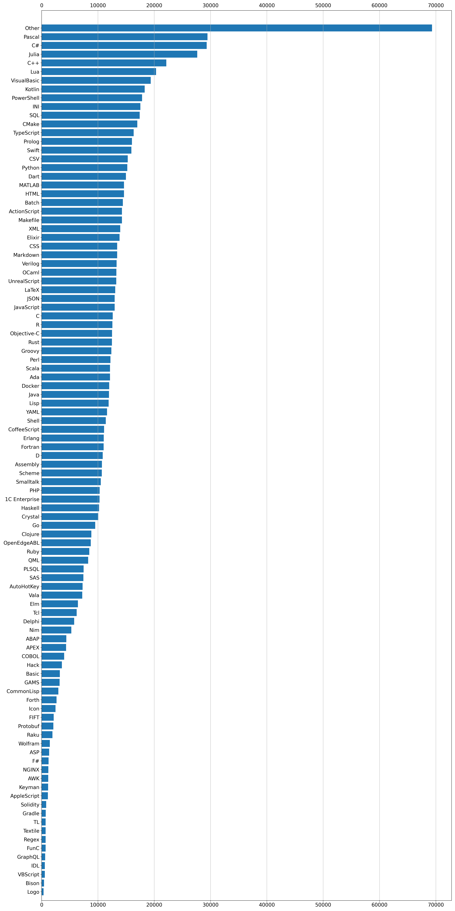

# Datataset for telegram language detection ML contest
The original data can be found [here](https://disk.yandex.ru/d/PSVcZTZYfCbhng).

## Dataset structure:

```bash
files
├── 1C Enterprise
│   ├── 00054368c5c1a57764ef84a7dad6a2fb79c37f48.1cd
│   ├── 00070cf386cb520af4158531939bd3fe9a770f44.1cd
│   ├── 000887dabbed376fe8c99eeca2378582c19f6545.1cd
│   └── ...
├── ABAP
│   ├── 00030023767a57dfdd540a4620a04cb58a021779.abap
│   ├── 0003dcd444839ff2efb1d2b9ea9e41e1793cc59a.abap
│   ├── 0006157ea297295a9717fc000362a3a5cd20c611.abap
│   └── ...
├── ActionScript
│   ├── 00060adda4e37e43ef032eda9c8afb0d085b3899.as
│   ├── 000ac3cfcd7851a44d76269bf82a72bb5e1540a3.as
│   ├── 000cbe873070e4de2a60538174ca7333e4a5dd8b.as
│   └── ...
├── Ada
│   ├── 000002c77491ce4885ca78eb1c4789502e2b04a0.adb
│   ├── 00014cb56447f3f740fe4fadaac5b9c326daca50.adb
│   ├── 000787f8049841c0a71c0d9e4d11eecf85459086.adb
│   └── ...
└── ...
```

## Usage in code
You can found mapping from languages common names to enum (corresponding to `TGLANG_LANGUAGE_*` enums) in `scripts/languages_list.py` file.
Example of usage:
```python
from scripts.languages_list import languages
from pathlib import Path

data = Path("data/files")

labels = []
files = []

for file_path in data.glob("*/*"):
    label = Languages.from_string(file.path).value
    labels.append(label)
    files.append(file)

# do training/inference with labels and files
...
```
## Languages distribution
